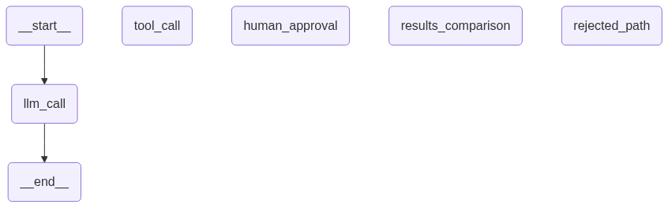

# Human-in-the-Loop Trip Planning Agent (LangGraph + Claude)

A stateful, multi-node travel planning assistant built using **LangGraph** and **Anthropic Claude API**. The agent generates live web search queries for flights and hotels using DuckDuckGo, pauses execution for explicit human approval before running tools, and processes raw search outputs through dedicated comparison and summarization nodes.

The project includes two tools:

- **Flight Search** — fetches the available flights from the origin country to the destionation country on the specified date.
- **Hotel Search** — fetches the available hotels in the destionation country on the specified date and total number of days.

---

---

## Architecture Diagram



---

## Node Breakdown

| Node                     | Responsibilities                                                                               |
| ------------------------ | ---------------------------------------------------------------------------------------------- |
| **`llm_call`**           | Evaluates conversation state and determines if search tools are needed.                        |
| **`human_approval`**     | Pauses execution via `interrupt()` to require human user sign-off before running web searches. |
| **`tool_call`**          | Executes live DuckDuckGo web searches for flights and hotels using input parameters.           |
| **`results_comparison`** | Evaluates retrieved flight and hotel options side-by-side to extract optimal choices.          |
| **`rejected_path`**      | Handles graceful termination if the human reviewer rejects tool execution.                     |

---

## Tech stack

| Layer                       | Technology                              |
| --------------------------- | --------------------------------------- |
| LLM                         | Claude Haiku 4.5                        |
| Language                    | Python                                  |
| Framework                   | LangGraph                               |
| Web Search Tools            | DuckDuckGo Search                       |
| State Persistence           | `InMemorySaver`                         |
| Human-in-the-Loop Mechanics | `interrupt()` and `Command(resume=...)` |

---

## Project structure

```text
langgraph-trip-planner/
│
├── agent.py                # State, node definitions, and graph assembly
├── main.py                 # Flight and hotel web search tools
├── tools.py                # CLI execution loop & HITL approval handling
├── requirements.txt
├── .gitignore
├── README.md
│
└── docs/
    └── graph.png           # Graph diagram
```

---

## Getting started

### Prerequisites

- Python 3.10+

Needs to be updated!

### 1. Clone the repository

```bash
git clone https://github.com/SuryaPrakash-24/langgraph-trip-planner.git
cd langgraph-trip-planner
```

### 2. Install dependencies

```bash
pip install -r requirements.txt
```

### 3. Set your Claude API key

Sign up on [platform.claude.com](https://platform.claude.com/), if not done already, and generate a new API key.

**Linux / macOS**

```bash
export ANTHROPIC_API_KEY="your_api_key_here"
```

**Windows (PowerShell)**

```powershell
setx ANTHROPIC_API_KEY "your_api_key_here"
```

Restart the terminal after setting the variable.

### 4. Run the code

```bash
python main.py
```

The inital Claude API connection takes ~10–15 seconds and the final response (after user approval) takes ~30-40 seconds.

---

## License

MIT
